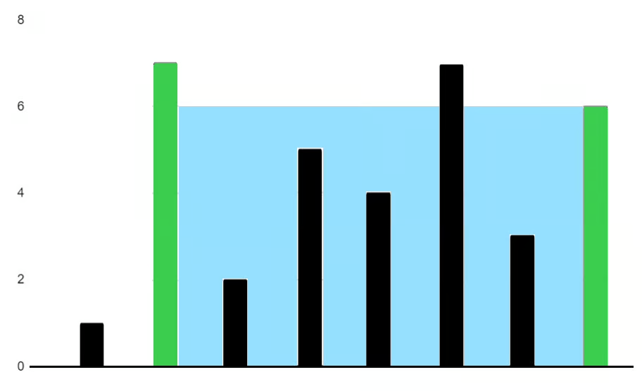

# Container With Most Water

You are given an integer array `heights` where `heights[i]` represents the height of the ith bar.

You may choose any two bars to form a container. Return the maximum amount of water a container can store.

### Example 1

```
Input: heights = [1,7,2,5,4,7,3,6]
Output: 36
```

### Example 2
```
height = [2,2,2]
Output: 4
```

### Constraints
- `2 <= heights.length <= 10^5`
- `0 <= heights[i] <= 10^4`